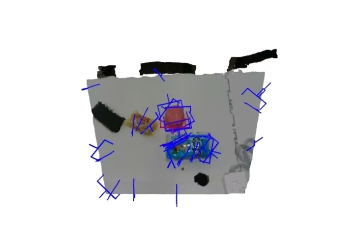

# 6DRoboArmGraspWork

基于 RealSense D435i camera 和 GraspNet project 的 6D 抓取位姿估计


效果：在实时点云上进行的抓取估计，蓝色是过滤后的可靠抓取，红色是评分（可靠性）最高的一个


## 项目环境

### 系统配置
- **操作系统**: Linux (Ubuntu)
- **Python version**: 3.10
- **ROS version**: ROS2 Humble
- **CUDA version**: CUDA12.8
推荐使用conda虚拟环境运行anygrasp。

### 获取Graspnet
```bash
# 克隆 anygrasp_sdk 仓库
git clone https://github.com/graspnet/anygrasp_sdk.git

# 克隆 graspnetAPI 仓库
git clone https://github.com/graspnet/graspnetAPI.git
```
然后根据官方README进行本地构建。

### 核心依赖
（详情见requirement.txt）
NOTE：依赖可以改，关键是版本要匹配

#### RealSense 摄像头
pyrealsense2 & RealSense SDK 

#### 3D 深度学习框架
torch，pytorch3d，pointnet2-pytorch，MinkowskiEngine，scipy

#### 可视化与处理
open3d，opencv-python (cv2)，numpy，graspnetAPI，graspnetSDK

#### ROS
rclpy，geometry_msgs，std_msgs，

### 许可证
- **AnyGrasp**: 需要许可证文件 (`xxx.lic`, `xxx.public_key`, `xxx.signature`)
  - 位置: `anygrasp_sdk/grasp_tracking/license/`
  - 状态检查: `python3 -c "from tracker import AnyGraspTracker; ..."`

---

## Scripts 功能说明

### 1. py_pointcloud.py

**功能**: RealSense 点云实时获取与 OpenCV 渲染

#### `PointCloudState`
点云显示状态管理类。

| 成员 | 类型 | 说明 |
|------|------|------|
| `yaw` | float | 绕 Y 轴旋转角度 (弧度) |
| `pitch` | float | 绕 X 轴旋转角度 (弧度) |
| `translation` | ndarray | 平移向量 (3,) |
| `distance` | float | 相机到物体距离 |
| `rotation` | property | 旋转矩阵 (3,3) |
| `pivot` | property | 旋转中心点 (3,) |

#### 函数

**`view(v, pc_state)`**
- **输入**: v (N,3) 世界坐标点, pc_state 视图状态
- **输出**: (N,3) 相机坐标系下的点
- **功能**: 点云坐标变换

**`project(v, pc_state)`**
- **输入**: v (N,3) 相机坐标点, pc_state 视图状态
- **输出**: (N,2) 图像平面坐标
- **功能**: 3D 点投影到 2D 图像

**`render_pointcloud(out, verts, texcoords, color, pc_state)`**
- **输入**: 
  - out: 输出图像数组
  - verts (N,3): 顶点坐标
  - texcoords (N,2): 纹理坐标 [0,1]
  - color (N,3): 颜色值 [0,255]
  - pc_state: 视图状态
- **功能**: 将点云渲染到图像

**`main()`**
- **功能**: RealSense 实时点云显示
- **参数**:
  - `--width`: 图像宽度 (默认 640)
  - `--height`: 图像高度 (默认 480)
  - `--fps`: 帧率 (默认 30)
  - `--clip-distance`: 深度裁剪距离 (默认 1.5m)
- **输出**: OpenCV 窗口实时显示点云

**用法**:
```bash
python3 scripts/py_pointcloud.py --clip-distance 1.5
```

---

### 2. realsense_to_anygrasp.py

**功能**: RealSense 实时抓取检测与追踪

**类**:

#### `RealSenseToAnyGrasp`
RealSense D435 点云适配器。

| 方法 | 说明 |
|------|------|
| `__init__(width, height, fps, clip_distance)` | 初始化配置 |
| `start()` | 启动相机流，初始化点云生成器 |
| `stop()` | 停止相机流 |
| `get_pointcloud_data()` | 获取对齐的点云和颜色数据 |

**`get_pointcloud_data()` 返回值**:
```python
(points, colors)
points : ndarray (N, 3)    # 点云坐标 (米)
colors : ndarray (N, 3)    # RGB 颜色 [0, 1]
```

#### `AnyGraspConfig`
追踪配置类。

| 参数 | 类型 | 说明 |
|------|------|------|
| `checkpoint_path` | str | 模型权重路径 |
| `filter` | str | 滤波器类型 (oneeuro/kalman/none) |
| `debug` | bool | 是否启用可视化 |

#### `main()`
- **功能**: 主程序，实时追踪与可视化
- **参数**:
  - `--checkpoint-path`: 模型路径 (必需)
  - `--clip-distance`: 深度裁剪 (默认 1.5m)
  - `--filter`: 滤波器类型 (默认 oneeuro)
  - `--debug`: 启用 Open3D 可视化
  - `--grasp-stride`: 检测采样间隔 (默认 6)
  - `--redetect-cooldown`: 重检冷却帧数 (默认 30)
  - `--score-drop-threshold`: 评分下降阈值 (默认 0.4)
  - `--track-loss-threshold`: 追踪丢失阈值 (默认 0.5)

**质量监测逻辑**:
- 首帧：检测所有候选，按 stride 采样
- 追踪丢失 > 50% → 触发重检
- 评分下降 > 40% → 触发重检
- 重检冷却期：30 帧内最多重检一次

**输出**:
```
首帧: 检测 1024 抓取, 追踪 171 抓取，得分: [0.003, 0.349]
重检(得分下降10.5%): 检测 1024 抓取, 追踪 171 抓取，得分: [0.005, 0.142]
F31: 追踪中...
```

**用法**:
```bash
python3 scripts/realsense_to_anygrasp.py \
  --checkpoint-path anygrasp_sdk/grasp_tracking/log/checkpoint_tracking.tar \
  --debug
```

---

### 3. tracking.py

**功能**: 在realsense_to_anygrasp.py 的基础上增加了 ROS2 话题发布

**核心特性**:
- ROS2 发布话题
- 4 个独立话题（位置、姿态、宽度、评分）
- 30Hz 发布频率
- 自适应质量监测

**类**:

#### `RealSenseAdapter`
RealSense D435 点云获取。

| 方法 | 说明 |
|------|------|
| `start()` | 启动相机 |
| `stop()` | 停止相机 |
| `get_pointcloud_data()` | 获取点云和颜色 |

#### `GraspTrackerNode`
ROS2 节点 - 追踪与话题发布。

**发布话题**:

| 话题 | 消息类型 | 内容 |
|------|---------|------|
| `/grasp/position` | PointStamped | x, y, z (米) |
| `/grasp/rotation` | QuaternionStamped | qx, qy, qz, qw |
| `/grasp/width` | Float64 | 宽度 (米) |
| `/grasp/score` | Float64 | 评分 [0, 1] |

**主要方法**:

**`timer_callback()`**
- **频率**: 30Hz (0.033s)
- **流程**:
  1. 获取点云
  2. 调用追踪器更新
  3. 质量监测（丢失/评分下降）
  4. 发布话题
  5. 可视化

**`publish_grasp(grasp)`**
- **输入**: 单个抓取对象 (GraspGroup[0])
- **功能**: 发布 4 个 ROS2 消息
- **转换**: 旋转矩阵 → 四元数 (scipy.spatial.transform.Rotation)

**`visualize(points, colors, target_gg)`**
- **功能**: Open3D 实时可视化点云和抓取

**参数**:
- `--checkpoint-path`: 模型路径 (必需)
- `--clip-distance`: 深度裁剪 (默认 1.5m)
- `--filter`: 滤波器 (默认 oneeuro)
- `--debug`: 启用可视化 (可视化影响发布频率)
- `--grasp-stride`: 采样间隔 (默认 6)
- `--redetect-cooldown`: 重检冷却 (默认 30)
- `--score-drop-threshold`: 评分下降阈值 (默认 0.4)
- `--track-loss-threshold`: 丢失阈值 (默认 0.5)

**用法**:
```bash
# 启动发布
python3 scripts/tracking.py \
  --checkpoint-path anygrasp_sdk/grasp_tracking/log/checkpoint_tracking.tar

# 启动 + 可视化
python3 scripts/tracking.py \
  --checkpoint-path anygrasp_sdk/grasp_tracking/log/checkpoint_tracking.tar \
  --debug

# 订阅话题（新终端）
ros2 topic echo /grasp/position
```
---

## 数据流与信号链

```
RealSense D435
    ↓ (640×480@30FPS, 深度+彩色)
[RealSenseAdapter] 
    ↓ (点云 N×3 米, 颜色 N×3 [0,1])
[AnyGraspTracker.update()]
    ↓ (检测: N个候选, 追踪: M个目标)
[质量监测]
    ├─ 追踪丢失 > 50% → 重检
    └─ 评分下降 > 40% → 重检
    ↓ (首帧或重检: 采样stride=6)
[目标抓取] 1024 检 → 171 追 [得分范围]
    ↓
[ROS2 发布] (30Hz)
    ├─ /grasp/position   (Point)
    ├─ /grasp/rotation   (Quaternion)
    ├─ /grasp/width      (Float64)
    └─ /grasp/score      (Float64)
    ↓
[机械臂订阅和处理信息]
    ↓
[机械臂运动规划 & 控制]
```

---

## 使用
详见scripts/ROS2_PUBLISHER.md。

### 验证 ROS2 话题发布
运行 `ros2 topic list | grep grasp` 查看话题，用 `ros2 topic echo /grasp/position` 查看数据。
脚本自定义参数详情查看

### 在 ROS1 中订阅话题
使用 `ros1_bridge` 建立 ROS1↔ROS2 通信。
